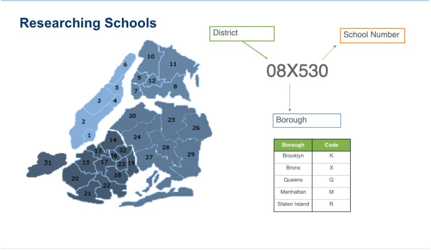

# NYC Students during COVID
Every year, OpenNYC and related NYC-based organizations release reports on education outcomes for students in the NYC public school system. These rich datasets usually include various demographic data, as well as geographic location which can then be subsequently used to determine socio-economic status.

Oftentimes it is hard to pinpoint one singular key-event which has had an impact on student performance. In fact, when it comes to evaluating the pedagogical-practices of teachers and the structure of the classroom, we note that not much changes on a year-by-year basis. 

However the pandemic and subsequent closure of schools is one of those rare ‘once-in-a-lifetime’ moments that truly divided student performance. In fact, this drop in academic performance has been reported as being the “single largest drop in math in 50 years” (Washington Post, 2023). 

As such, the availability of these rich data sets represents a valuable data-monitoring opportunity in order to assess if we are “back on track”, or continuing the plunge in the NYC public school system. 

# Datasets
Datasets were provided by
[NYC OpenData](https://opendata.cityofnewyork.us/data/)

 - 2017 - 2022 Demographic Snapshot 
 - 2018 - 2021 Daily Attendance by School
 - 2021 Students In Temporary Housing
 - English Language Arts Test Results 2013-2023 **

** Important notes from dataset 

 "Due to COVID-19 pandemic, the exams were not administered in 2020" and were optional for students to take in 2021. In 2018, NYSED rescaled the Math and ELA exams to account for a change in test administration from 3 days to 2 days. Results from 2018 - 2022 can be compared to each other but cannot be compared to prior years (or to 2023). Exams were cancelled in 2020 and voluntary in 2021. 21% of eligible students took the exam in 2021, no data for those years is included. 

# What to know
What is a DBN (District Borough Number)?

The DBN or District Borough Number is the combination of the District Number, the letter code for the borough, and the number of the school. Every school in NYC Public Schools (NYCPS) has a District Borough Number.

What is Economic Need Index?

The Economic Need Index (ENI) estimates the percentage of students facing economic hardship.
The student Economic Need Index (ENI) is a metric calculated used by the Department of Education to investigate and incorporate economic diversity in NYC's schools.

### Learning Standards 

- Level 1  = Not Meeting Learning Standards
- 'Pct Level 1' - Percentage of students who scored in Level 1 range  
- Level 2 = Partially Meeting Learning Standards
- 'Pct Level 2' - Percentage of students who scored in Level 2 range
- Level 3 = Meeting Learning Standards
- 'Pct Level 3' - Percentage of students who scored in Level 3 range 
- Level 4 = Meeting Learning Standards with Distinction  
- 'Pct Level 4' - Percentage of students who scored in Level 4 range

# Issues / Notes
Results from 2018 to 2022 can be compared to each other but cannot be compared to prior years  (or to 2023) due to a change in test adiministration. 

# Analysis
DOE Students in Temporarily Housing

English Language Arts Achievement Levels (Citywide)

.png>)

Math Achievement Levels (Citywide)

Citywide Attendance Rate:

.png>) 

Monthly Attendance Rate by Borough:
.png>)

ELA Percentage of level 1 by District:

ELA Percentage of level 4 by District:

# School with Highest Economic Need Index - 12X211

Students that were Present:

Enrollment: 

## ELA Results between 2013 - 2023
Achievement Levels at 12X211: 

## Math Results between 2013 - 2023

# School with Lowest Economic Need  - 02M183

Students that were Present:

Enrollment:

## ELA Results between 2013 - 2023
Achievement Levels at 02M183: 

## Math Results between 2013 - 2023

Key Insights:
-There is a steady decrease in scores in numerous Levels (1-4) for English over the years and the biggest dips occur during the beginning of the pandemic.
-There is a steady decrease in scores in numerous Levels (1-4) for Math over the years and the biggest dips occur during the beginning of the pandemic.
-For general scores in the beginning, there is a strong positive correlation between the number of Level 1 scores among students and the Level 4 scores among students.

Recommendations:
-We should try to see if the dip in scores is due to people leaving the city or other pandemic related issues like students being more frequently absent or technology issues.
-Conduct further research to understand the root causes of lower test scores over time and develop comprehensive strategies to improve results in math and english in schools across the five boroughs.

# Goal
Analyze an NYC dataset of student data to analyze student performance. Some analytical questions/goals you may want to consider include:
- How has test performance changed after Covid? Does this vary across demographics?
- How has student attendance changed after Covid?
- How can we design a comprehensive data dashboard which provides up-to-date information on NYC student performance. 
